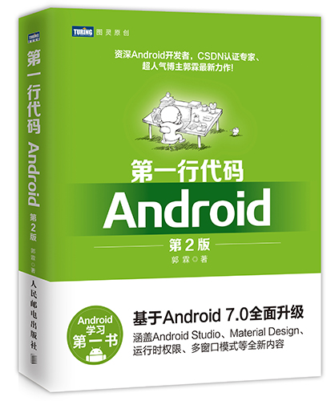

### 读后感
- [《第一行代码》](https://blog.csdn.net/guolin_blog/article/details/52032038)
  - [郭霖的专栏](https://blog.csdn.net/guolin_blog)
  - [郭霖GitHub](https://github.com/guolin)

### 总结
- 1, 思路清晰, 通俗易懂, 入门必备
- 2, 如何把一个问题阐述清楚?
- 3, 如何规划一个新知识体系的学习路线?